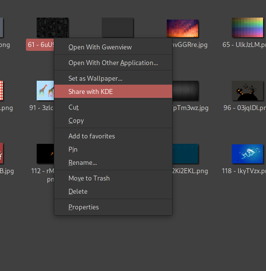
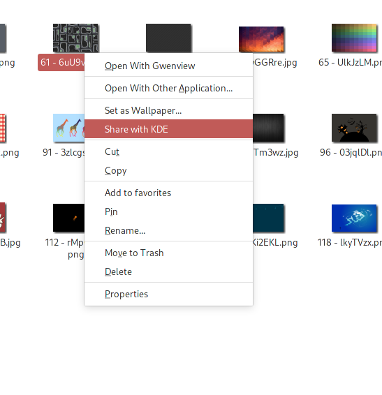

# kconnectnemo by drexfall
kconnecctnemo is a Nemo action to share files through KDE Connect, right in the Nemo file browser!




## Features

- Simple one command install
- Almost no dependencies, except for Nemo and KDE Connect _(ofcourse!)_
- Share **_any and as many_** files as you want!

## Installation

You can install this action via two methods

#### Method 1 - Automatic Depedency Download _(only for pacman and apt-get users)_

Clone the repository and run the install&#46;sh file

```sh
git clone https://github.com/drexfall/kconnectnemo.git ~/.local/share/kconnectnemo/
cd ~/.local/share/kconnectnemo/ 
```

Just for yourself
```sh
./install.sh
```

For everyone

```sh
sudo ./install.sh
```

### Method 2 - Manual Dependency Download

Install the kdeconnect and libnotify packages and continue with Method 1

## Development

Nothing is better than a little help!
Create pull requests and mention bugs all you want and they'll be attended ASAP!

## Donation

Mind helping a developer out?

[](https://www.buymeacoffee.com/drexfall)
